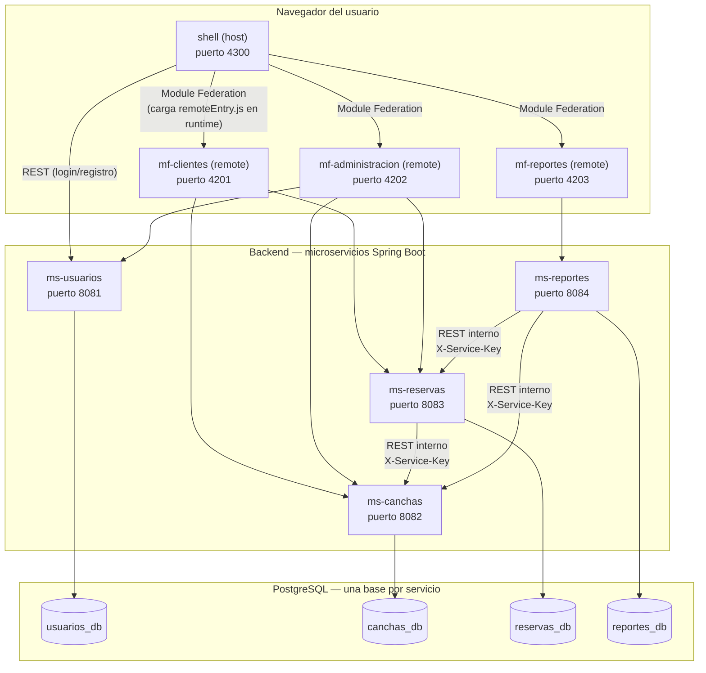
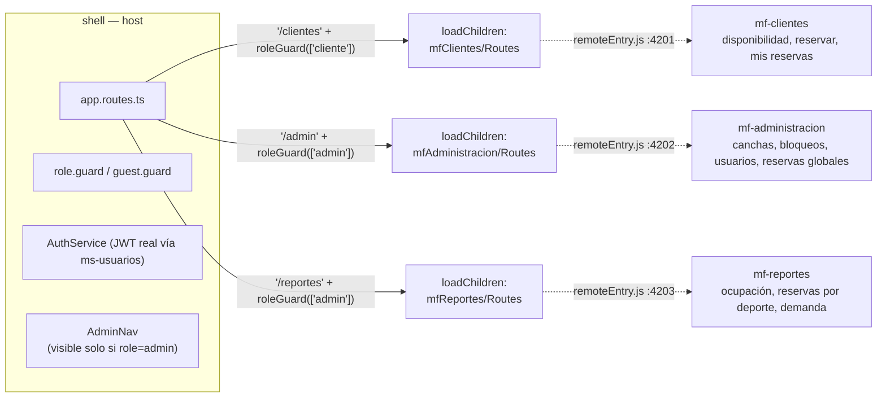
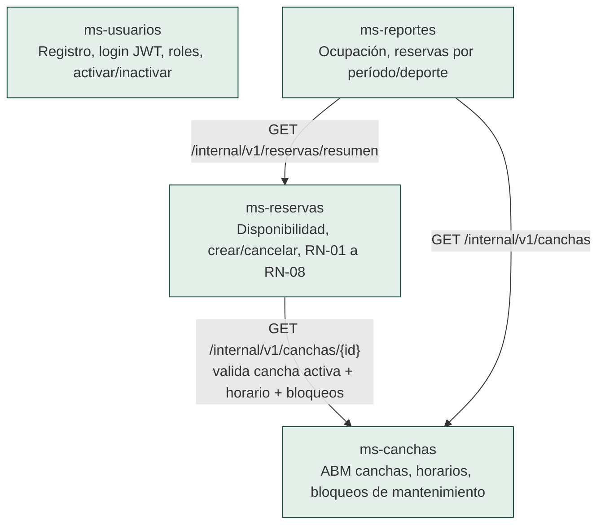
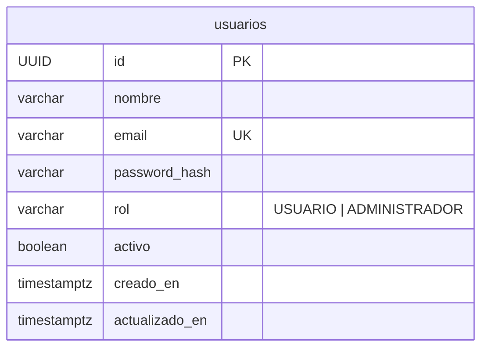
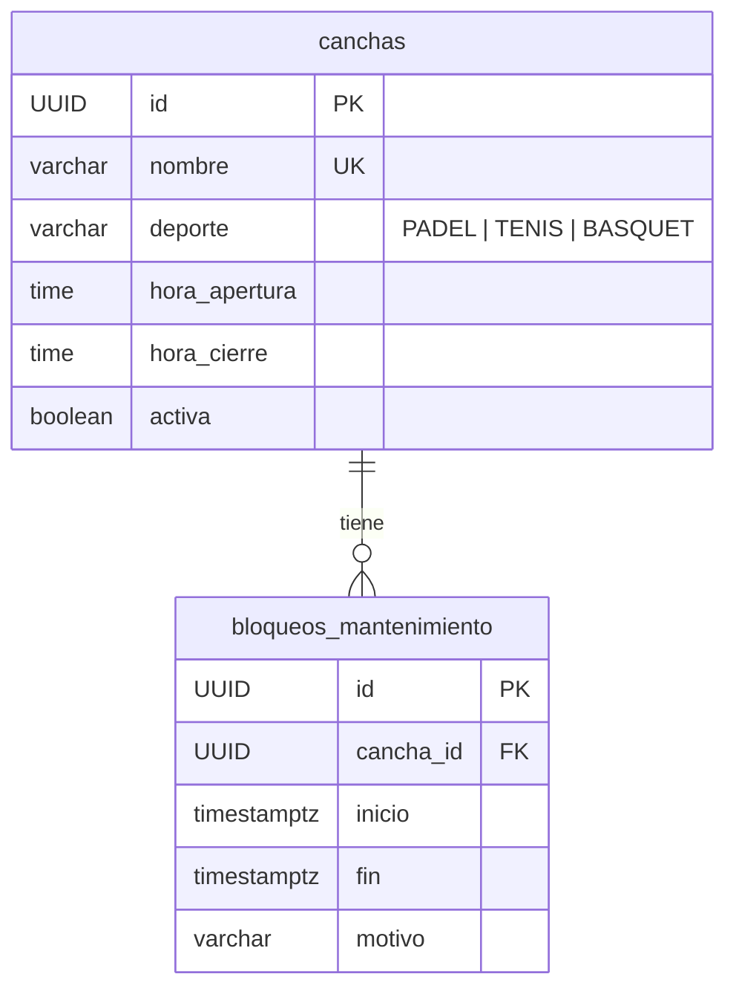
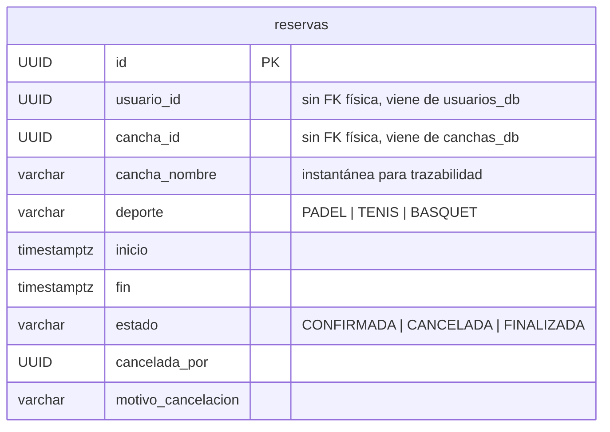
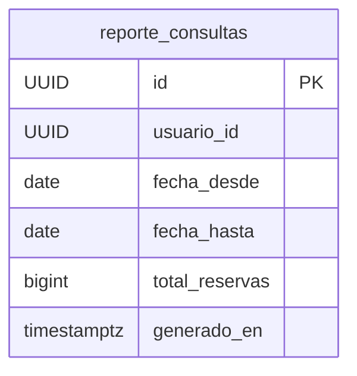

# Arquitectura del Sistema de Reserva de Canchas Deportivas

Este documento describe la arquitectura implementada: microfrontends con Module Federation en el frontend, microservicios Spring Boot en el backend, y una base de datos PostgreSQL independiente por servicio.

## 0. Modelo C4 (Contexto y Contenedores) en Structurizr DSL

El modelo formal C4 vive en [`c4/workspace.dsl`](c4/workspace.dsl) y es la fuente de verdad de los diagramas de **Contexto** (C1: Usuario Final / Administrador ↔ el sistema como caja negra) y **Contenedores** (C2: los 4 microfrontends, los 4 microservicios y sus 4 bases PostgreSQL, con las relaciones entre ellos). Los diagramas Mermaid de las secciones 1-3 de este documento son una vista renderizada equivalente, pensada para leerse directo en GitHub sin herramientas adicionales.

Para visualizar o editar el DSL con el editor visual de Structurizr:

```bash
docker run --rm -p 8080:8080 -v "$(pwd)/docs/architecture/c4:/usr/local/structurizr" structurizr/lite
# abrir http://localhost:8080
```

Para solo validar la sintaxis sin levantar el servidor:

```bash
docker run --rm -v "$(pwd)/docs/architecture/c4:/usr/local/structurizr" structurizr/cli validate -w workspace.dsl
```

## 1. Diagrama de contenedores



**Estado actual:** el frontend está completo e integrado vía Module Federation, y hace llamadas HTTP reales a los 4 microservicios (login/registro, disponibilidad, reservas, canchas, usuarios y reportes) — ya no opera en modo mock.

## 2. Diagrama de microfrontends (Module Federation)



Cada remote expone únicamente sus rutas (`exposes: { './Routes': './src/app/app.routes.ts' }`); el `shell` es el único responsable de layout, autenticación y navegación entre módulos (`AdminNav` vive en el shell, no duplicado en cada remote).

## 3. Diagrama de microservicios e integraciones REST



`ms-usuarios` no depende de ningún otro servicio ni es consultado internamente por ellos: la identidad del usuario viaja en el JWT (claim `sub` + `roles`), no por llamada REST. Toda comunicación entre microservicios usa la cabecera `X-Service-Key` (`ServiceKeyInterceptor`) para autenticar tráfico interno, separado de la autenticación JWT de usuarios finales.

## 4. Modelo de datos por servicio

Cada microservicio administra su propio esquema PostgreSQL, sin joins ni foreign keys entre bases distintas (las relaciones externas se guardan como UUID sueltos, ej. `usuario_id` en `reservas_db` no referencia físicamente a `usuarios_db`).

### `usuarios_db`


### `canchas_db`


### `reservas_db`


La tabla `reservas` tiene un constraint `EXCLUDE USING gist (cancha_id WITH =, tstzrange(inicio, fin, '[)') WITH &&) WHERE (estado = 'CONFIRMADA')` — esto aplica **RN-02 (no solapamiento)** a nivel de base de datos, no solo en código Java, garantizando la regla incluso bajo concurrencia.

### `reportes_db`


`reporte_consultas` es una tabla de auditoría (qué admin generó qué reporte y cuándo) — los datos del reporte en sí (ocupación, cancelaciones) se calculan al vuelo consultando `ms-reservas` y `ms-canchas` por REST, sin duplicar su información.

## 5. Decisiones de arquitectura

| Fecha | Decisión | Motivo |
|---|---|---|
| 2026-08 | Angular 20 (standalone components) + Webpack 5 vía `@angular-architects/module-federation` | Angular CLI usa esbuild/Vite por defecto, pero Module Federation requiere el runtime de Webpack |
| 2026-08 | Java 17, Spring Boot, Maven multi-módulo, arquitectura hexagonal (`domain/port/in`, `domain/port/out`) en cada microservicio | Separar reglas de negocio de infraestructura (JPA, REST) facilita testear RN-01 a RN-08 de forma aislada |
| 2026-08 | Sin API Gateway/BFF | El PDF lo marca como opcional; con 4 servicios el frontend puede llamarlos directo sin sobre-ingeniería |
| 2026-08 | RN-02 aplicada con constraint `EXCLUDE` en PostgreSQL, no solo validación en Java | Garantiza la regla bajo condiciones de carrera concurrentes, que una validación solo en código no puede prevenir |
| 2026-08 | Frontend construido primero en modo mock (`localStorage`), luego conectado a los 4 microservicios reales vía `HttpClient` | Permitió avanzar y validar UX/flujos de Module Federation en paralelo al desarrollo del backend, sin bloquear a ningún frente |
| 2026-08 | CORS habilitado explícitamente en los 4 microservicios, restringido al origen del `shell` (`http://localhost:4300`) | Necesario porque el navegador bloquea peticiones cross-origin por defecto; se limita al único origen que hace llamadas reales |
| 2026-08 | `spring-boot-starter-flyway` agregado a los 4 microservicios (además de `flyway-core`) | Spring Boot 4.1.0 movió el auto-configure de Flyway a un módulo separado; sin este starter, Flyway nunca se ejecutaba y Hibernate generaba el schema sin los constraints de negocio (ej. `EXCLUDE` de RN-02) |
